# 📚 ExamSystem — Tam Yığın Sınav Yönetimi Platformu

[](https://www.oracle.com/java/)
[](https://spring.io/projects/spring-boot)
[](https://react.dev)
[](https://www.postgresql.org/)
[](LICENSE)

ExamSystem, eğitim kurumları için uçtan uca sınav yönetimi sağlayan modern, modüler bir platformdur. Kurs yönetimi, sınav planlama, soru havuzu, öğrenci kayıtları ve gönderim takibi gibi tüm süreci tek bir çözümde birleştirir.

**Asal hedef:** Eğitim kurumlarının sınav süreçlerini dijitalleştirerek daha verimli, güvenli ve ölçeklenebilir bir sistemin sunulması.

---

## Proje Görüntüleri

Aşağıda projenin çalışan ekran görüntüleri ve kullanıcı arayüzü örnekleri yer almaktadır:

| | | |
|---|---|---|
| 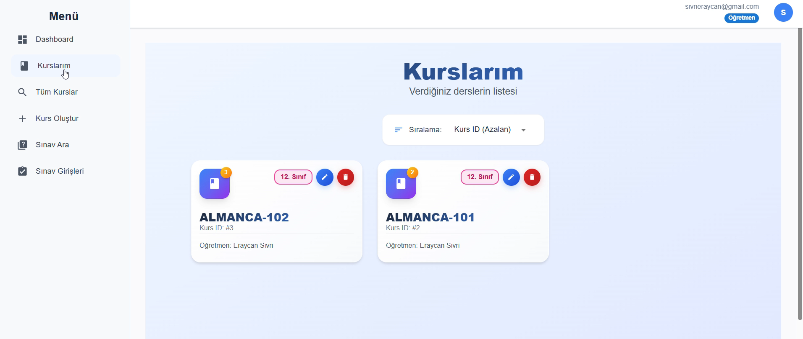 | 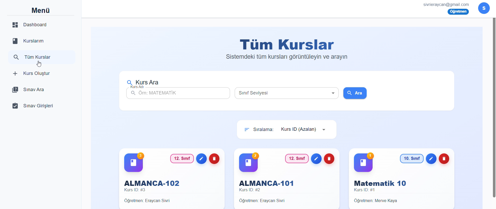 | 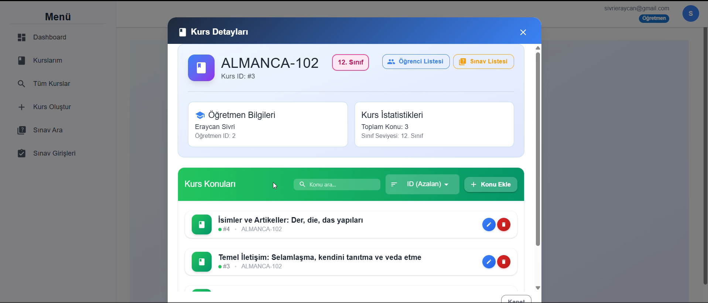 |
| 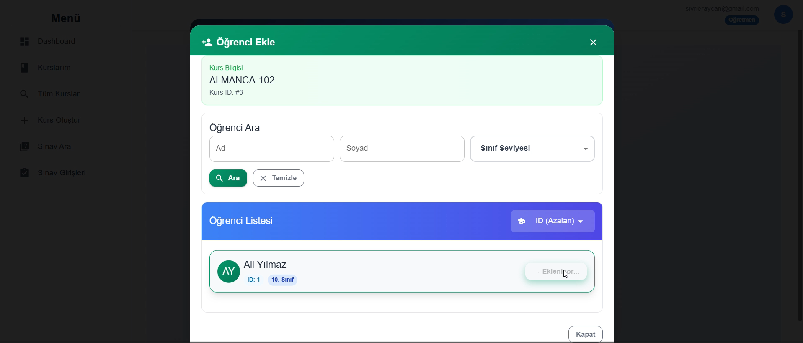 | 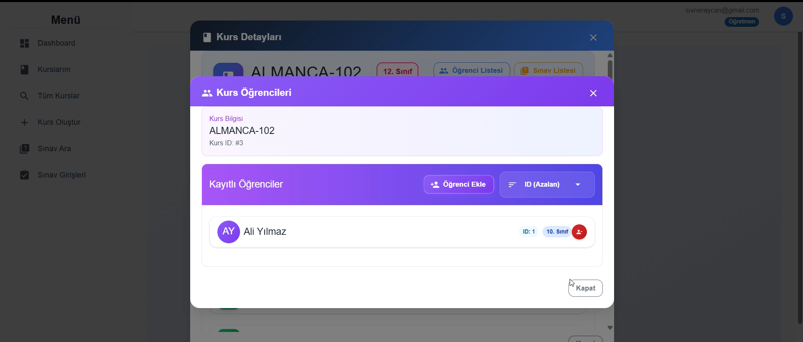 | 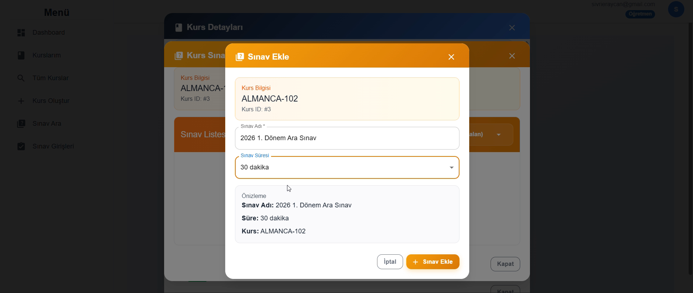 |
| 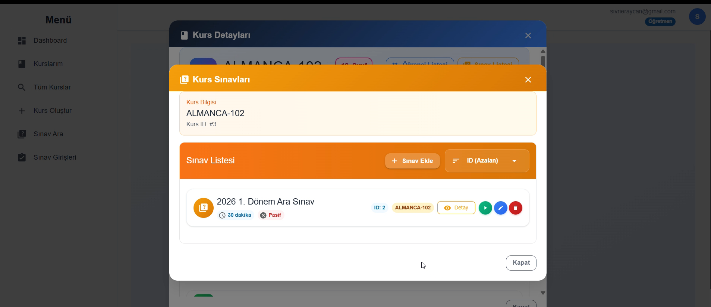 | 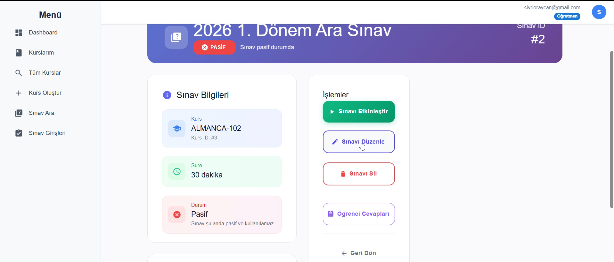 | 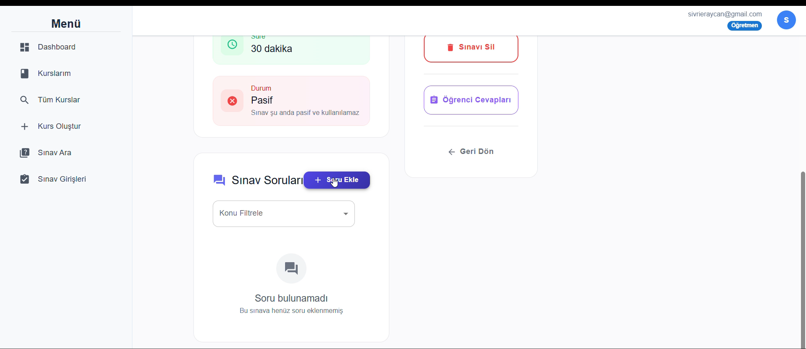 |
| 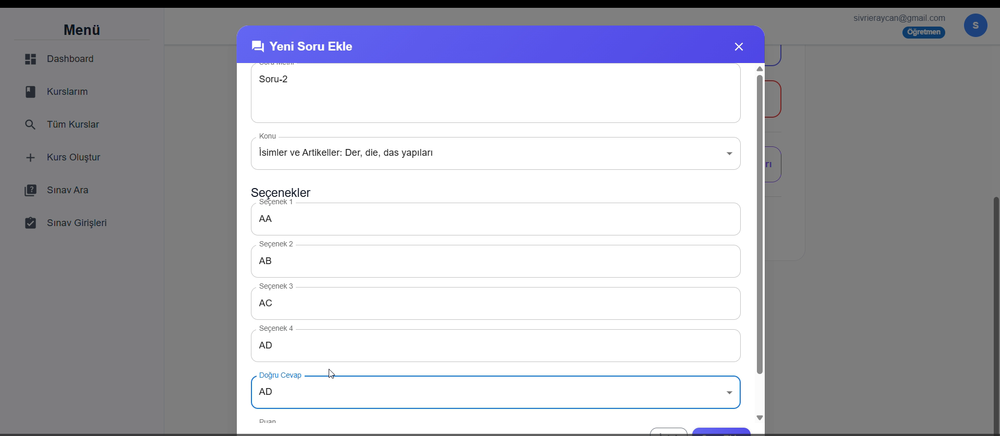 | 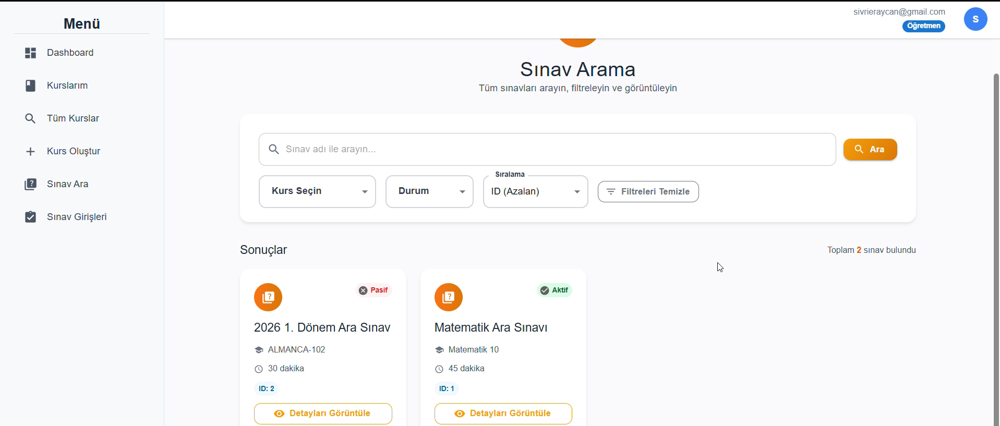 | 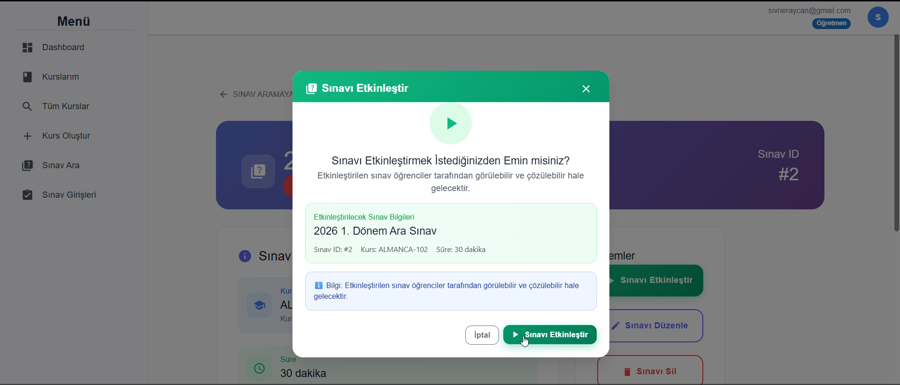 |
| 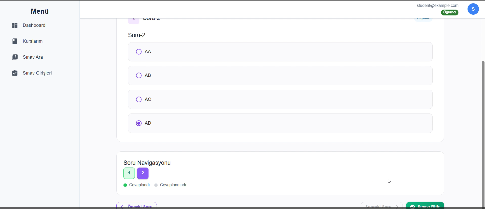 | 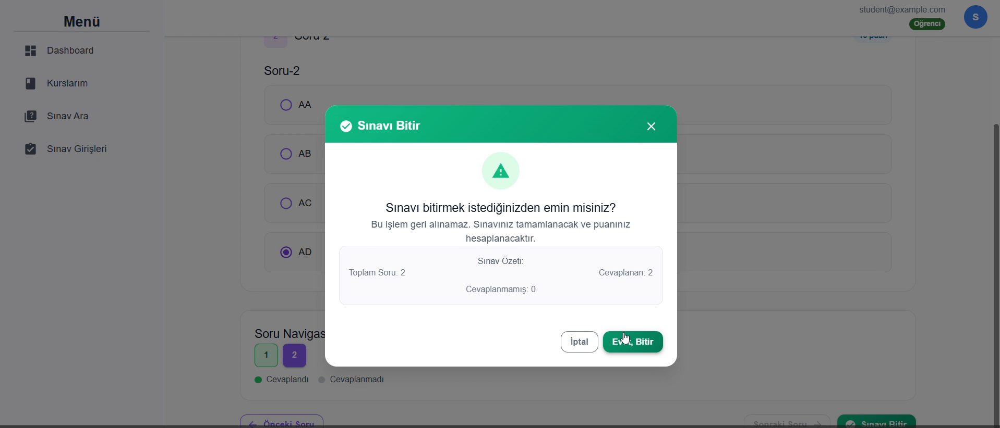 | 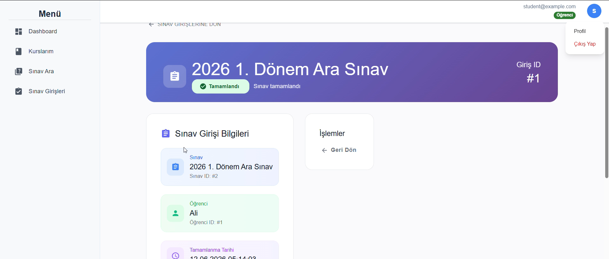 |
| 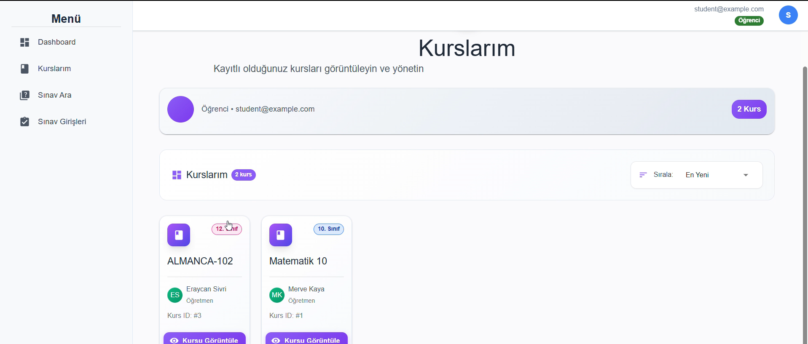 | 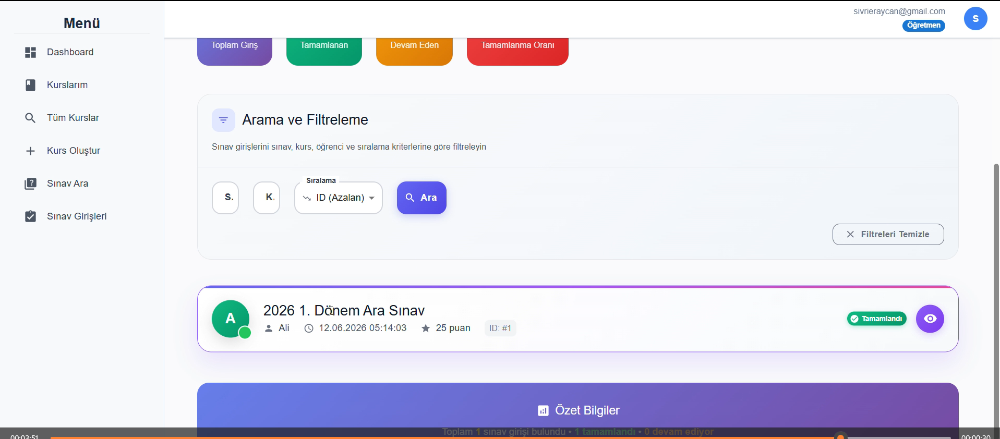 | 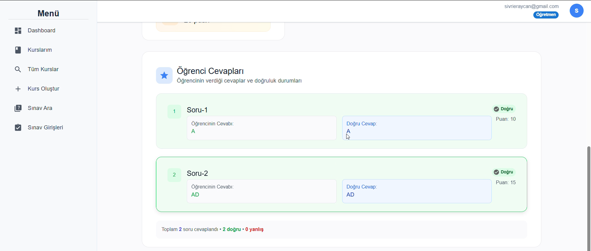 |
| 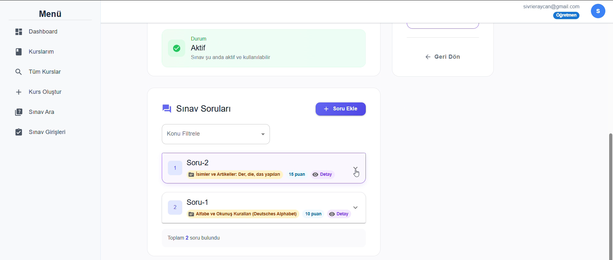 | 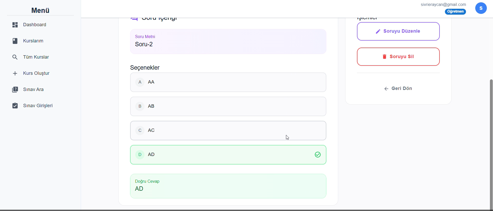 | |

---

## 📋 İçindekiler

- [Ne çözülüyor?](#ne-çözülüyor)
- [Neden tercih edilmeli?](#neden-tercih-edilmeli)
- [Mimari](#mimari)
- [Kullanıcı odaklı özellikler](#kullanıcı-odaklı-özellikler)
- [Hazır örnek veriler](#hazır-örnek-veriler)
- [Çalıştırma](#çalıştırma)
- [Üretime hazır nokta](#üretime-hazır-nokta)
- [Proje görüntüleri](#proje-görüntüleri)

## 🎯 Ne çözülüyor?

### Geleneksel Sınav Yönetiminin Sorunları

- kurs ve sınav verilerinin farklı yerlerde saklanması
- öğretmenlerin sınav ve soru sürecini elle yönetmek zorunda kalması
- öğrencilerin sınavlara erişim ve kaydının dağınık olması
- güvenli kimlik doğrulama ve yetkilendirme ihtiyacı

ExamSystem, bu ihtiyaçları aşağıdaki şekilde ele alır:

- kurs, ders, sınav ve soru yönetimini tek bir merkezde toplar
- rollere göre öğretmen, öğrenci ve yönetici deneyimini ayrı kılar
- JWT ve Google OAuth2 ile güvenli oturum açma sağlar
- frontend ile backend arasında token yenileme ve izin kontrolü sunar

## ✨ Neden tercih edilmeli?

- ✅ açık iş akışı: `Dashboard`, `My Courses`, `Take Exam`, `Create Course`, `Exam Submissions`
- 🔐 güçlü güvenlik: JWT tabanlı API yetkilendirmesi ve sosyal giriş desteği
- 🏗️ modüler yapı: backend mantığı `auth`, `course`, `exam`, `student`, `teacher`, `topic` şeklinde ayrılmış
- ⚡ hızlı frontend: React + Vite ile modern yönetim paneli deneyimi
- 🔄 ayrı geliştirme: backend ve frontend birbirinden bağımsız çalışır, kolay test edilir

## 🏛️ Mimari

- `ExamSystem/` — Spring Boot backend
- `ExamSystemFrontend/` — React + Vite frontend

Backend, REST API ve kimlik doğrulama kontrollerini yönetir. Frontend ise kullanıcı arayüzünü sağlar ve `http://localhost:8080/api` üzerinden backend ile iletişim kurar.

## 👥 Kullanıcı odaklı özellikler

### 🎓 Öğretmenler
- kurs oluşturma ve düzenleme
- sınav programlama
- soru havuzu yönetimi
- gönderimleri inceleme
- öğrenci kayıtlarını takip etme

### 📖 Öğrenciler
- kayıtlı kurslara erişim
- sınavlara katılma
- sınav cevaplarını gönderme
- geçmiş gönderimleri görme

### 🔓 Ortak özellikler
- kullanıcı kaydı ve oturum açma
- Google OAuth2 ile giriş
- JWT tabanlı token yenileme
- rol bazlı erişim kontrolü

## 🌱 Hazır örnek veriler

Backend ilk çalıştırıldığında aşağıdaki örnek veriler otomatik olarak eklenir:

- yönetici: `admin@example.com` / `admin123`
- öğretmen: `teacher@example.com` / `teacher123`
- veli: `parent@example.com` / `parent123`
- öğrenci: `student@example.com` / `student123`

Ayrıca sisteme örnek bir kurs, konu, sınav ve soru seti eklenir. Bu sayede uygulamayı açtığınızda doğrudan deneme yapabilirsiniz.

## Üretime hazır nokta

Aşağıdaki adımlar projeyi geliştirme ortamından üretime taşımak için temel yol haritasını verir.

### 1. Veritabanı

- PostgreSQL üzerinde `ExamSystem` veritabanı oluşturun.
- `ExamSystem/src/main/resources/application.properties` içindeki bağlantı bilgilerini güncelleyin.
- Üretimde `spring.jpa.hibernate.ddl-auto=validate` veya `none` kullanın; `update` yalnızca geliştirme için uygundur.

### 2. Güvenlik

- `application.security.jwt.secret-key` için güçlü ve gizli bir anahtar kullanın.
- Google OAuth2 için:
  - `GOOGLE_CLIENT_ID`
  - `GOOGLE_CLIENT_SECRET`
- `app.oauth2.redirectUri` değeri frontend’deki callback URL ile eşleşmelidir.

### 3. Backend paketleme

```powershell
cd ExamSystem
./mvnw clean package
```

Üretim için oluşturulan JAR, `target/` klasöründe yer alır.

### 4. Frontend paketleme

```powershell
cd ExamSystemFrontend
npm install
npm run build
```

Üretim yapısı `dist/` klasörüne çıkar.

## ⚡ Çalıştırma

### 🚀 Hızlı başlangıç (Geliştirme)

Projeyi hızlıca ayağa kaldırmak için aşağıdaki adımları takip edin.

**1. Backend başlat:**

```powershell
cd ExamSystem
./mvnw spring-boot:run
```

Backend `http://localhost:8080` adresinde çalışacaktır.

**2. Frontend başlat (yeni terminal):**

```powershell
cd ExamSystemFrontend
npm install
npm run dev
```

Frontend `http://localhost:5173` adresinde çalışacaktır.

**3. Test et:**

- Tarayıcıda `http://localhost:5173` aç
- Demo hesaplarla giriş yap:
  - **Öğretmen:** `teacher@example.com` / `teacher123`
  - **Öğrenci:** `student@example.com` / `student123`

> **Not:** Backend ilk başladığında otomatik olarak örnek veriler oluşturur. Veritabanınızda PostgreSQL çalışıyor olması gerekir.

### Üretim

- backend: `java -jar ExamSystem/target/ExamSystem-0.0.1-SNAPSHOT.jar`
- frontend: üretilen `dist/` klasörünü bir web sunucusuna (Nginx, Apache, CDN) dağıtın

> Frontend varsayılan olarak `http://localhost:5173` üzerinde çalışır. API istekleri `http://localhost:8080/api` adresine yönlendirilmelidir.

### 📋 Üretime hazır checklist

Proje üretime dağıtmadan önce şu adımları kontrol edin:

- [ ] **JWT Secret** oluştur: güvenli, uzun bir anahtarla güncelle
- [ ] **PostgreSQL veritabanı** kur ve bağlantı stringini ayarla  
- [ ] **Google OAuth2** kimlik bilgilerini elde et ve environment değişkenlerini ayarla
- [ ] **CORS ayarları** kontrol et (`application.properties` ve frontend axios config)
- [ ] **Frontend environment** ayarla (`.env` dosyası oluştur)
- [ ] **Backend** JAR dosyasına build et: `mvn clean package`
- [ ] **Frontend** production build yap: `npm run build`
- [ ] **Statik dosyaları** host et (verilen hosting sağlayıcıya göre)
- [ ] **API Swagger** dokumentasyonunu kontrol et: `http://api-url/swagger-ui.html`
- [ ] **Database migration** kontrol et (Hibernate DDL ayarları)

## Konfigürasyon

### Backend ayarları

`ExamSystem/src/main/resources/application.properties` önemli alanlar:

- `spring.datasource.url`
- `spring.datasource.username`
- `spring.datasource.password`
- `spring.jpa.hibernate.ddl-auto`
- `application.security.jwt.secret-key`
- `application.security.jwt.expiration`
- `application.security.jwt.refresh-token.expiration`
- `spring.security.oauth2.client.registration.google.client-id`
- `spring.security.oauth2.client.registration.google.client-secret`
- `app.oauth2.redirectUri`

### Frontend ayarları

`ExamSystemFrontend/src/utils/apiService.js` içinde API tabanlı:

- temel URL: `http://localhost:8080/api`
- otomatik token yenileme (401 durumunda)
- 403 yetki hatası yönetimi

## Proje yapısı

### Backend

- `ExamSystem/src/main/java/org/kafka/examsystem`
  - `auth`
  - `course`
  - `exam`
  - `exam_question`
  - `exam_submission`
  - `student`
  - `teacher`
  - `topic`
  - `user`

### Frontend

- `ExamSystemFrontend/src`
  - `pages`
  - `components`
  - `contexts`
  - `services`
  - `utils`

## Genişletme önerileri

- notlandırma ve raporlama özellikleri ekleme
- canlı sınav/zamanlayıcı desteği ekleme
- kurs bazlı bildirim sistemi kurma
- frontend ve backend entegrasyonunu tek bir dağıtım hattına taşıma

## Temel avantajlar

- düzenli işlem akışı ve rol bazlı erişim
- hem öğretmen hem öğrenci hem yönetici için tek platform
- modern frontend ve sağlam backend altyapısı
- üretime hazırlık için ayrı paketleme adımları


## Sunum (gif)

Eğer `docs/sunum.gif` dosyasını repoya eklerseniz GitHub README içinde doğrudan görüntülenir. GIF eklemek için en basit yöntem aşağıdaki Markdown satırını kullanmaktır:

```markdown

```

Alternatif olarak daha kontrollü yerleşim için HTML kullanabilirsiniz:

<p align="center">
  
</p>

Yerelde GIF'i açmak için küçük scriptler ekledim:

Windows (PowerShell):

```powershell
Start-Process -FilePath .\docs\sunum.gif
```

macOS:

```bash
open docs/sunum.gif
```

Linux:

```bash
xdg-open docs/sunum.gif
```

Dosyayı repoya ekledikten sonra README otomatik olarak GitHub üzerinde GIF'i gösterecektir.

